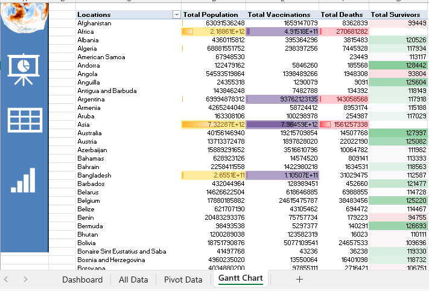
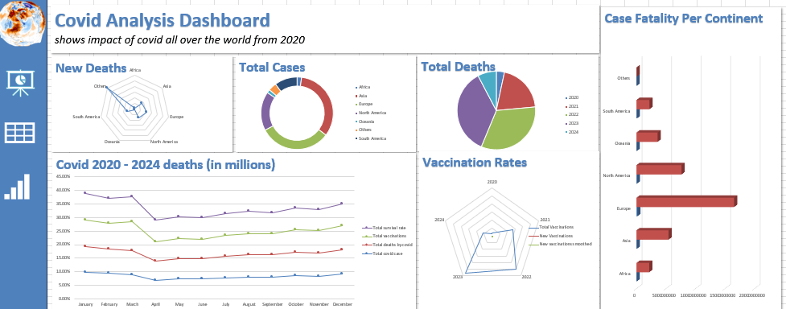
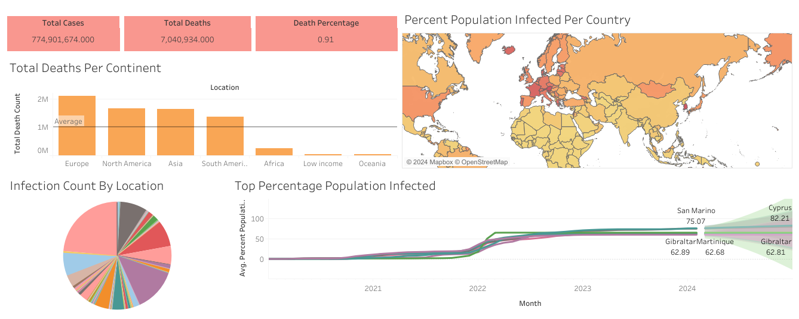

# COVID-19 Data Analysis using SQL

- To prepare data, Retrieve relevant data fields such as location, date, total cases, new cases, total deaths, and population from the dataset.
- Filter out duplicate values and clean the data to ensure accuracy and consistency for further analysis.

- To Analyze Total Cases vs Total Deaths,Compare total cases and total deaths for a specific location, such as India, to calculate the percentage of deaths relative to total cases over time.

- To Analyze Total Cases vs Population, Evaluate the percentage of the population infected with COVID-19 by comparing total cases to the population of a specific location, such as India, over time.

- For Identify Countries with Highest Death Counts countries with the highest total death count by excluding irrelevant locations and summing up new deaths for each location.

-  Assess the Infection Rate compared to Population,Determine countries with the highest infection rates relative to their population by calculating the percentage of population infected with COVID-19.

- For Calculate Death Count per Population, Determine countries with the highest death count per population by summing up total deaths and grouping them by location.

- To Visualize Vaccination Progress,Create a view to store data for later visualizations, such as the percentage of population vaccinated over time, by joining COVID-19 deaths and vaccinations data.

# COVID-19 Data Analysis using Excel

- Utilize Excel to clean raw COVID-19 data, removing duplicates, handling missing values, and formatting data for analysis.

- Apply Excel's built-in functions and features for data cleansing, such as removing special characters, correcting data types, and standardizing formats.

- Create informative charts and graphs in Excel to visually represent COVID-19 trends and patterns. Examples include line charts for daily case counts, bar charts for regional comparisons, and pie charts for percentage distributions.

- Utilize Excel's pivot tables to aggregate COVID-19 data based on different dimensions such as date, region, and demographic factors.

- Generate summary reports and insights by summarizing large datasets using pivot tables, enabling quick analysis and decision-making.

# COVID-19 Data Analysis using Tableau - [Viz Link](https://public.tableau.com/views/CovidDataAnalysis_17115618937080/Dashboard1?:language=en-US&:sid=&:display_count=n&:origin=viz_share_link)

- With Data Visualization, Utilize Tableau's powerful visualization tools to create interactive dashboards and visualizations for COVID-19 data analysis.

- Present key metrics such as total cases, total deaths, and vaccination progress in an intuitive and visually appealing manner.

- Using Geographic Analysis it's possible to explore COVID-19 data geographically using maps to visualize the spread of the virus across different regions and countries.

- Analyze regional variations in infection rates, mortality rates, and vaccination coverage to identify hotspots and trends.

- For Time-Series Analysis,Perform time-series analysis in Tableau to track the progression of COVID-19 cases, deaths, and vaccinations over time.

- Identify temporal patterns, trends, and seasonality in the data to understand the impact of interventions and policy changes.

- Conduct comparative analysis in Tableau to compare COVID-19 metrics between different countries, regions, or demographic groups.

- Visualize disparities in infection rates, mortality rates, and vaccination coverage to inform targeted interventions and resource allocation.

- Use Tableau's trend analysis capabilities to identify emerging trends and patterns in COVID-19 data.

- Detect sudden spikes or declines in cases, deaths, or vaccination rates to guide decision-making and public health responses.

- Leverage Tableau's forecasting features to predict future COVID-19 trends and outcomes based on historical data.

- Generate forecasts for cases, deaths, and vaccination coverage to anticipate potential challenges and plan accordingly.

- Enable stakeholders to explore COVID-19 data dynamically, filter information based on specific criteria, and gain actionable insights for decision-making.

# COVID-19 Data Analysis using Python (Pandas, Seaborn, Matplotlib)

- To install the required libraries use `pip install -r requirements.txt`.
  
- Import necessary libraries such as Pandas, Seaborn, Matplotlib for data manipulation, visualization, and analysis.

- Read the COVID-19 dataset using Pandas and explore its structure and content. Handle missing values by calculating the percentage of NULL values in each column and converting data types as needed.

- Perform exploratory data analysis to understand the distribution and relationships between variables.

- Visualize the relationships between new cases and new deaths, total deaths by continent, and correlation between different features using scatter plots, bar plots, and heatmaps.

- Calculate and visualize the correlation matrix between numeric features in the dataset.

- Convert categorical variables into numerical format and generate a correlation matrix plot to identify correlations between all features.

- Plot the total COVID-19 deaths over time to visualize the trend and fluctuations in mortality rates.

- Use line plots to track the progression of COVID-19 deaths over time, providing insights into the impact of the pandemic.

- Explore additional relationships and patterns in the data, such as the correlation between different variables and the impact of testing on mortality rates.

- Conduct comparative analysis and visualization to compare COVID-19 metrics across different regions, countries, or time periods.

- Summarize key findings and insights from the analysis, highlighting trends, correlations, and significant observations.

- Provide recommendations for further analysis or areas of focus to deepen understanding and inform decision-making.

# COVID-19 Data Analysis Dashboard using Python (Panel, hvPlot)

- This dashboard utilizes WEB SCRAPING techniques to dynamically update its data every time it runs. This ensures that the charts in the dashboard reflect the most current information available, allowing users to gain deeper insights into the data.

- This dashboard provides interactive visualizations and insights into COVID-19 data using Python libraries such as Panel and hvPlot.

- Explore various aspects of COVID-19 data, including total cases, total deaths, vaccination progress, and more.

- **Interactive Widgets:** Utilize interactive widgets such as sliders and radio buttons to dynamically filter and visualize data based on user preferences.

- **Data Exploration:** Explore COVID-19 data by continent, year, and location, allowing for in-depth analysis and comparison.

- **Visualizations:** Visualize trends and patterns in COVID-19 data through scatter plots, bar charts, and interactive tables.

- **Dashboard Layout:** Organize visualizations into a cohesive dashboard layout for easy navigation and understanding.

- **Insightful Analysis:** Gain insights into COVID-19 trends, vaccination rates, and the impact of the pandemic on different regions and populations.

- **Installation:** Install required libraries using `pip install panel hvplot pandas requests`.

- **Data Retrieval:** Uncomment the code to download the latest COVID-19 data from the specified URL or use an existing dataset.

- **Data Analysis:** Perform exploratory data analysis and visualization using the provided Python code.

- **Dashboard Deployment:** Deploy the interactive dashboard using Panel's `servable()` method for sharing and collaboration.

- This COVID-19 data analysis dashboard offers a comprehensive platform for exploring and understanding the ongoing pandemic's impact worldwide.

- Explore the dashboard's interactive features to gain insights into COVID-19 trends, vaccination progress, and more, aiding decision-making and public health efforts.

